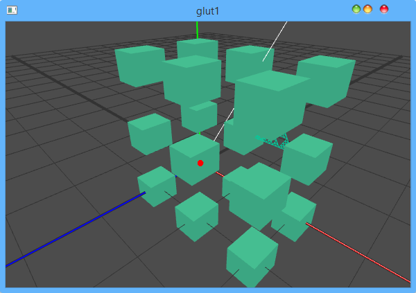

GLUS 
====

A pure C scene setup and render library.

You can try it by this [release](./doc/glus.zip)

# quick start
You can steup a scene simply by this command  
`camera		1 2 1		0 0 0	0 1 0` 
`projection	55 1.5	.1 100`
