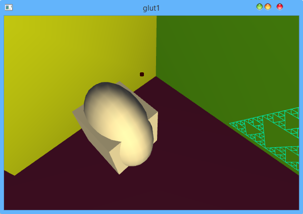

GLUS 
====

A pure C scene setup and render library.

You can try it by this [release](./doc/glus.zip)


## quick start
You can steup a scene simply by this command <br>
`camera		1 2 1		0 0 0	0 1 0`<br>
`projection	55 1.5	.1 100`<br>
`fps 30`<br>
`shadelevel 1`<br>
`shape grid`<br>
`shape axis`<br>
and you can get scene like bellow.It has a grid and axis,and the shape will be draw a mesh.<br>


## basic

### control the object
You custom the object after create it.

You can change the color or material of shape by `diffuse`,`ambient`,`specular`,`shininess` and `transp`.

You can transform a shape by `translate`,`scale`,`rotate`.

For example,you custom the grid and axis by this
``` 
shape grid		diffuse	.2 .2 .2	specular 0 0 0 ambient 0 0 0
shape axis		scale	9	9	9
```
So you will get this view:<br>


### light
Light is enable by default,and if you not setup a light, a point white light will be create at `(20.0f, 12.0f, 3.0f)`.

You can disable light use `islight 0` ,to enable it use `islight 1`.

To setup a light,use `light		0	12 8.5 2 1   .9 .8 .5 1`.The light type is `GL_LIGHT0` and it's a point light at `(12, 8.5, 2)` with color `(.9, .8, .5, 1)`.To setup a parallel light change `12 8.5 2 1` to `12 8.5 2 0`.


### camera
To display a scene correctly, you need setup camera and projection,for example
    `camera	10 20 10	0 0 0	0 1 0`<br>
    This will create a camera at point `(10,20,10)` watch to point `(0,0,0)` and it's up vector is `(0,1,0)`.<br>
    Also command `projection	55 1.5	.1 100` will setup a perspect project matrix *angle* is *55* ,rato is 1.5f,near plane is at 0.1f and far plane is at 100.0f.

### shape
There are some simple shape build in c code, to use it just type `shape shape_name`.

Shape name contain `"axis", "sphere", "cube", "teapot", "grid", "snow", "square", "cylinder", "cone"`.

eg.The amazing snow shape:


For create more shape ,you can see [mesh](#mesh),[peano curve](#peano) and the [chaos game](#chaos)

### mesh
With mesh , you can draw any shape. To use it, you must specify the *vertex list* *normal list* and *face list*.
The format is 
```
n_point n_normal n_uv n_face
point list :    (0,0,0)
normal list :   <0,0,0>
uv list:        (0,1)
n_face_id id_point_list id_normal_list id_uv_list
n_face_id id_point_list id_normal_list id_uv_list
```
The normal and uv is optional,but you must specify vertex.

eg. draw a cube
```
mesh		8	6	4	6
			(0,0,0)	(1,0,0) (1,1,0) (0,1,0)
			(0,0,1)	(1,0,1) (1,1,1) (0,1,1)
			<0,0,-1> <0,0,1> <0,-1,0> <0,1,0> <1,0,0> <-1,0,0>
			(0,0)	(0,1)	(1,1)	(1,0)
			4	0 3 2 1		0 0 0 0		0 1 2 3 // far
			4	4 5 6 7		1 1 1 1		0 1 2 3 // near
			4	0 1 5 4		2 2 2 2		0 1 2 3 // bottom
			4	7 6 2 3		3 3 3 3		0 1 2 3 // top
			4	5 1 2 6		4 4 4 4		0 1 2 3 // right
			4	4 7 3 0		5 5 5 5		0 1 2 3 // left
```


the comment format is like `c/c++`;

### peano
Peano curve can be create by string production.
* The format is 
`peano (atom, f-string,x-string,y-string, len, angle, len-ratio) itera-level start-angle use-random`
* the `atom` specify the orginal shape
* In string production, you can use these
  * `F` draw a `len` lenght line in current direction, and in each itera it will be replace by `f-string`
  * `+` turn positive `angle` base on current direction
  * `-` is the opposite operate of `+`
  * `[` will save current state, such as `len` `direction`
  * `]` can restore the state to what you save last.

  * `X` will be replace by `x-string` in each itera.
  * `Y` will be replace by `y-string` in each itera as the same as `X`
* `len` specify the length of `F` command
* `angle` specify the angle of each turn
* `len-ratio` is to cut the lenght in each itera,otherewise the shape will be very when itera many times.
* `itera-level` specify the times of itera
* `start-angle` can rotate the shape you created
* `use-radom` will change the rangle in each itera

eg. you can use this command to draw a tree
```
peano	(F[++F---F]--F, FF-[-F+F+F]+[+F-F-F], nil, nil, 1, 22, 2) 3 90 0
    scale 10 10 10
	translate	1 0 0
	diffuse		1 1 0
```


### chaos

Chaos game is also a iterated function system,but it has the ability to draw any image.

And the command is hard to use, becaus you need find the matrix for transform.

The format is 
```
max-itera-point 
matrix-number 
matrix
```
The matrix format is `m_11 m_12 m_21 m_22 m_13 m_23 `

eg. use this to draw a dragon:
```
chaos   400000
	2
	.824074 .281482 -.212346 .864198 -1.882290 -0.110607 .78
	.088272 .520988 -.463889 -.377778 0.785360 8.095795 .22
    diffuse 1 1 0
```

 

## advance 
### inc
You needn't write all code in one file,using `inc ( file.sdl )` all the code in `file.sdl` will be loaded.

### def, use
Using `def` you can wrap the complicated code and give it a human-friendly `name`, So you can refer it by the `name` by `use` command.

```
def triangle
{
	peano	(X, [F+F+F]FF, F+F+F, nil, 4, 120, 2) 5 0 0

	translate	1 1 0
	diffuse		1 0 0
}

use triangle
```


Note: the `name` is just for `def` and `use`, not for object in scene.

### Ray trace
This library has a simply support for ray trace,and just can used on some simply shape:`sphere`,`cube`,`square`,`cylinder`,`cone`.

* Before use it, please slow down the fps,because ray trace will cost much time to complete.<br>
using `fps 1`

* first setup a scene:
```
// far
shape square diffuse .4 .8 .1 scale 9 3 9 translate 0 0 -3 
// left
shape square diffuse .8 .9 .1 scale 3 3 9 rotate 90 0 1 0 translate -3 0 0
// bottom
shape square diffuse .4 .1 .3 scale 9 9 9 rotate -90 1 0 0 translate 0 -3 0
// right
shape square diffuse .4 .1 .3 scale 3 3 3 rotate 90 0 1 0 translate 3 0 0
// near
shape square diffuse .4 .8 .1 scale 3 3 3 translate 0 0 3 

shape cube	
		translate 0.5 0.5 .6  scale 0.7 0.1 0.7
		shininess .8
		name s1

shape	sphere
		translate 0.9 1.5 1  scale 0.3 0.4 0.3
		//shininess .8
		//transp .8		
		name s2
```

* then you can raytrace to draw it,and you can see that shadow will auto be calculated.

before after 

### bool
With the power of ray trace,you can also draw some boolean object.
```
shape cube	
		translate 0.5 1.5 1  scale 0.2 0.2 0.2
		//shininess .8
		//transp .8		
		name s1
		
shape	sphere
		translate 0.5 1.5 1  scale 0.3 0.4 0.2
		//shininess .8
		//transp .8		
		name s2
```
```
bool s1 & s2
```

**original**



**after**

